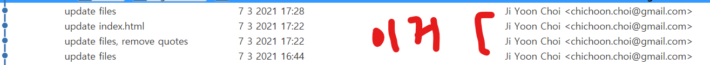

# 초기 설정

- git 저장소 생성 or Clone, 커밋 이메일 등록 등

## git --version

- 깃 버전 확인하기

## git config --global user.name [유저명]

- commit시에 적용될 내 닉네임 설정
- 커밋할 때마다 커밋 해시와 함께 찍히는 사용자 이름

## git config --global user.email [이메일]

- commit시에 적용될 내 이메일 설정
- 커밋할 때마다 커밋 해시와 함께 찍히는 사용자 이메일
- 

## git init

- 해당 폴더에 **새 repository**를 꾸린다
- 예: repo_folder 내에서 git init 명령어를 사용하면 repo_folder가 하나의 로컬 repository가 됨
- 이 작업까지 완료하면 해당 repository에서 commit할 준비가 된 상태

## git remote add origin [github 링크]

- 만약 해당 폴더가 비어있고, github 상에 만든 새 repository와 연동하고자 할 때 사용

## git clone [github 링크]

- 만약 해당 폴더가 비어있고, github 상에 이미 존재하는 repository를 폴더에 복사하고 연동하고자 할 때 사용

## 선택사항

### git config --global alias.[단축명령] [명령어]

- 명령어의 단축버전을 설정할 수 있다
  > git config --global alias.co checkout
  >
  > > checkout 이라는 명령어의 단축어를 co로 설정

### git config --global core.quotepath off

- 경로명에 한국어가 있을 경우 한국어를 제대로 표시해줌
- 근데 어지간하면 파일이름은 한국어로 하지말자
