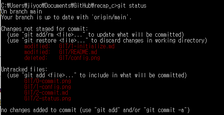
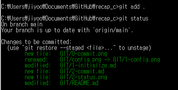
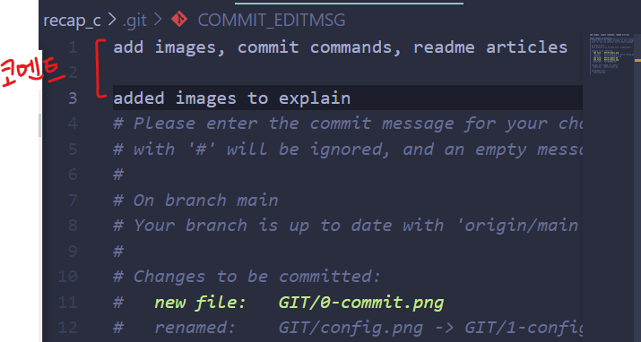
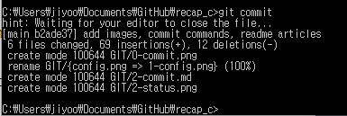

# Commit하기

- index에 변경사항 올리기, stage된 변경사항 commit하기 등

## git status

- 현재 repository의 working tree와 index의 **상태**를 보여주는 명령어
- 
- **Your branch is up to date with [브랜치명]**
  - 현재 내가 작업중인 Branch 이름
- **Changes not staged for commit**
  - 파일들이 수정되었지만 Index로의 Staging이 이루어지지 않았기 때문에 stage 대기중인 파일들
- **Untracked files**
  - 이전 커밋 이후에 생성된 파일로, 한번도 Index에 올라가본 적 없는 (변화가 추적되지 않은) 새 파일

## git add [파일명1] [파일명2]

- 파일을 commit하기 전에 **index**에 등록
- 여러 파일을 띄어쓰기로 지정하여 올릴 수 있음
  > git add test.png test.html
  >
  > > test.png와 test.html이 stage됨
- 파라미터에 파일명 대신 . 만 쓰면 **해당 폴더 내 모든 파일**을 등록함

  > git add .
  >
  > >   
  > > git add .를 이용해 모든 파일을 stage했음 (commit할 준비가 됨)

## git commit

- 이전 commit 시점부터 지금까지 index에 stage된 모든 변경사항들을 **commit**
- 
- 
- commit 명령어를 입력하면 별도의 text editor가 열리면서 **commit message**를 적는 칸이 나옴
  - ubuntu에선 nano, windows에선 기본 editor를 vscode로 설정해서 code
- 적당히 변경사항 요약을 적고 저장하고 파일을 닫아준다
- 
- 코멘트 작성이 완료되면 자동으로 변경사항을 commit하고, 그 결과가 콘솔에 표시됨

## git commit -m
