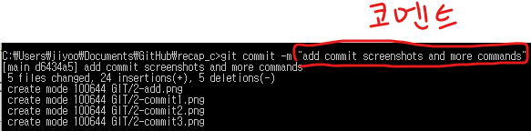
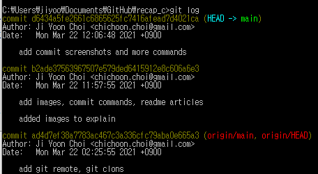

# Commit하기

- index에 변경사항 올리기, stage된 변경사항 commit하기 등

## git status

- 현재 repository의 working tree와 index의 **상태**를 보여주는 명령어
- 
- **Your branch is up to date with [브랜치명]**
  - 현재 내가 작업중인 Branch 이름
- **Changes not staged for commit**
  - 파일들이 수정되었지만 Index로의 Staging이 이루어지지 않았기 때문에 stage 대기중인 파일들
- **Untracked files**
  - 이전 커밋 이후에 생성된 파일로, 한번도 Index에 올라가본 적 없는 (변화가 추적되지 않은) 새 파일

## git add [파일명1] [파일명2]

- 파일을 commit하기 전에 **index**에 등록
- 여러 파일을 띄어쓰기로 지정하여 올릴 수 있음
  > git add test.png test.html
  >
  > > test.png와 test.html이 stage됨
- 파라미터에 파일명 대신 . 만 쓰면 **해당 폴더 내 모든 파일**을 등록함

  > git add .
  >
  > >   
  > > git add .를 이용해 모든 파일을 stage했음 (commit할 준비가 됨)

## git commit

- 이전 commit 시점부터 지금까지 index에 stage된 모든 변경사항들을 **commit**
- 
- 
- commit 명령어를 입력하면 별도의 text editor가 열리면서 **commit message**를 적는 칸이 나옴
  - ubuntu에선 nano, windows에선 기본 editor를 vscode로 설정해서 code
- 적당히 변경사항 요약을 적고 저장하고 파일을 닫아준다
- 
- 코멘트 작성이 완료되면 자동으로 변경사항을 commit하고, 그 결과가 콘솔에 표시됨

## git commit -m "[코멘트]"

- commit message를 별도의 text editor에서 열지 않고, 명령어로 바로 넘겨주는 방법
- 
- -m 패러미터 뒤에 코멘트를 "" (큰따옴표) 로 감싸주어 입력한다
- 결과는 위의 git commit과 같은 대신, text editor에서 편집하지 않고 쉽게 message 작성이 가능함

## git log

- 현재 Repository의 변경 이력을 보여줌
  - 처음엔 가장 최근 commit부터 3~4개정도만 보여주지만, 엔터치다 보면 끝도없이 나옴;
  - **q**를 누르면 log 명령어에서 탈출할 수 있다
- 
- **commit [어쩌구저쩌구 코드]**
  - Commit의 이름
- **Author: [사용자명] <[이메일]>**
  - Commit을 작성한 사용자의 이름과 이메일
- **Date: [시간]**
  - Commit을 작성한 시간
- Date 아래에는 **Commit 시에 작성한 코멘트**들이 보여짐

### git log --decorate

- 태그 정보를 포함한 이력을 보여줌

## git tag [태그이름]

- 태그를 추가
- git tag를 통해 지금까지 추가한 태그 목록을 볼 수도 있음

### git tag -a [태그이름]

- 주석 달린 태그를 추가
- commit 코멘트 작성 시처럼 새 창에서 주석을 작성하는 페이지가 뜸

### git tag -am "[코멘트]" [태그이름]

- 태그의 주석을 별도의 페이지가 아닌 현재 페이지에서 작성

### git tag -d [태그이름]

- 해당 태그를 삭제

### git tag -a [태그이름] -m "[코멘트] [커밋이름]

- 해당 커밋에 주석 달린 태그를 추가
- 커밋 이름은 긴 버전 말고 짧은 버전 써도 됨
  > git tag -a v1.0.0 -m "version 1.0.0" asd123
