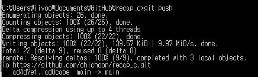
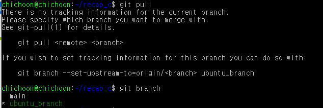
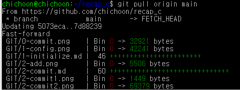

# 원격 저장소와 연동하기

- 로컬 저장소 commit들 올려보내기 등

## git push

- 지금까지 만든 commit들을 원격 저장소에 올림
- 
- push가 완료되면 완료 메시지와 함께 간략하게 무슨 동작을 했는지, 커밋 이름과 함께 보여줌

### git push origin [브랜치명]

- 해당 브랜치에 push함

### git push origin [태그이름]

- 태그를 원격 저장소에 올리기 (브랜치와 비슷한 사용법)

### git push origin --tags

- 모든 태그를 원격 저장소에 올리기

### git push origin :[태그이름]

- 태그를 원격 저장소에서 삭제하기

## git pull

- 원격 저장소에서 업데이트된 사항들을 로컬 저장소로 내려받기
- 
- 만약 로컬에서 현재 작업중인 브랜치에 대한 변경점이 없을 경우, **There is no tracking information for the current branch**라고 나온다
- 현재 우분투에서 작업중인 Branch가 ubuntu_branch인데 해당 브랜치에선 업데이트된 사항이 없기 때문
  - 이때는 어떤 브랜치에서 정보를 받아올 건지 명시해줘야 함

### git pull [remote명] [브랜치명]

- 해당 브랜치에서의 업데이트 사항을 내려받아 merge하기
- 보통 remote명은 origin을 사용한다

  > git pull origin main

- 
- main 브랜치에서 업데이트된 정보들을 현재 브랜치로 내려받았다
