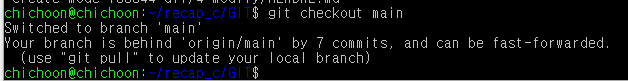

# Branch

- 브랜치 생성, merge 등

## git checkout [브랜치명]

- 현재 작업 브랜치를 변경한다
- 
- ubuntu_branch에서 작업하다가 main 브랜치로 이동하였다
- 현재 main 브랜치보다 원격 저장소 내용이 많이 업데이트되어 있어 저런 안내가 나옴
  - (git pull로 변경점 받아오면 됨)

## git branch

- 모든 브랜치를 보여준다

### git branch -a

- 원격 저장소 브랜치 포함 모든 브랜치를 보여준다

### git branch [브랜치명]

- 새 브랜치 생성

### git branch -d [브랜치명]

- 브랜치 삭제
