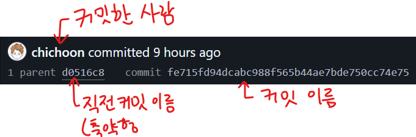

# Git

- CLI 환경에 익숙해져야 하기 때문에 CLI 위주로 서술한다
  - (GUI 프로그램은 vscode, sourcetree, github desktop 이용중)
- 해당 readme.md 파일에서는 **이론적인 부분에 대한 서술**
  - 명령어 등은 하단의 명령어 목차 확인

### ✔ CLI 명령어 확인하기

1. [초기 설정](1-initialize/README.md)
2. [Commit 과정](2-commit/README.md)
3. [원격 저장소와 연동](3-remote/README.md)
4. [Commit 수정](4-modify/README.md)
5. [Branch](5-branch/README.md)

### 목차

1. [버전관리 시스템](#버전관리-시스템)
2. [Git](#Git)
3. [Repository](#Repository)
4. [Commit](#Commit)
5. [원격 저장소](#원격-저장소)
6. [Branch](#Branch)
7. [버전 되돌리기](#버전-되돌리기)
8. [협업](#협업)
9. [외전](#외전)

## 버전관리 시스템

- 형상관리, 소스관리, VCS (Version Control System) 등으로도 불림
  - **버전** : 의미있는 변화
  - 프로그램을 만들 때 주석 따위를 수정하는 것이 아닌, 기능의 개선 또는 버그의 수정 등 두드러지는 변화
- 이러한 의미있는 변화들을 발전 순서대로 개별 정리한 것이 **버전관리 시스템**
  - 예시: 위키피디아 기여내역, 게임 업데이트 내역, ..
    > 조별과제 레포트1.pdf  
    > 조별과제 레포트2.pdf  
    > 조별과제 레포트-최종.pdf  
    > 조별과제 레포트-최종의 최종.pdf  
    > 조별과제 레포트-최종-오타수정.pdf
    >
    > > 다양한 버전들을 모아둔 점에서 일종의 버전관리 시스템이라 볼 수 있음
- 버전 관리 시스템을 사용하면 가능한 것들
  - 과거의 버전과 현재 버전을 비교하기
  - 실수를 되돌리기 위해 과거 버전을 불러오기
  - 다른 사람이 작성한 버전을 쉽게 확인하고 내 버전에 적용하기
  - 다른 사람과 같은 프로젝트에서 작업해도 작업물이 충돌하지 않음
  - 컴퓨터에 문제가 생겨도 백업해둔 버전을 불러와서 복구 가능
- 이처럼 버전 관리 시스템을 이용함으로써 얻을 수 있는 이득이 많기 때문에 대개 프로젝트의 시작부터 끝까지 버전관리 시스템을 사용하게 된다

## Git

- 버전관리 시스템 중 하나
- 모든 코드의 역사들이 commit이라는 형태로 기록된다
- Git 자체는 CLI 환경에서 명령어를 이용해서 명령을 내려야 함
  - GUI 환경에서 커밋, 브랜치 등의 작업을 하고 싶다면 Sourcetree, Github Desktop 등의 좋은 프로그램이 많다
- Git을 온라인 저장소상에 올려서 다른 사람과 쉽게 협업할 수 있도록 돕는 호스팅 사이트가 **Github**이다

## Repository

- 프로젝트의 디렉토리
  - 모든 변화가 기록되는 곳 = **저장소**
- 특정 디렉토리를 VCS의 repository로 설정할 경우, 해당 디렉토리에서 이루어진 **모든 변화를 기록**할 수 있다

### 저장소 구분

- 우리가 실질적으로 작업을 하는 폴더는 **Working Tree**
- Working Tree 내의 변화가 기록되는 곳은 **Index**
- Index에 기록된 변화를 Commit할 때, Commit들이 저장되는 곳을 **Repository**
- Index에 기록된 변화를 Commit하면 해당 시점부터 부모 Commit이 되는데, 이를 **HEAD**라 부름

## Commit

- Git은 저장소 내에 생긴 모든 변화를 지켜보고 있으며, 이러한 변화 (변경사항) 을 기록하는 행위를 **Commit (커밋)** 이라 함
- Commit 시에는 이전 Commit 시점부터 현재 Commit 시점까지의 모든 변경 이력들을 **내용 요약, 시간, 이름 (해시값)** 과 함께 기록함
- 
- Commit을 할 때마다 변경점이 뭔지 간략하게 **메시지**를 적어서 올리며, 이것이 없으면 Commit이 되지 않는다
  - 보통 첫번째 줄에 요약한 내용, 두번째 줄은 빈 칸, 세번째 줄은 변경 이유를 적는 것을 권장함

### Staging

- Commit 작업은 저장소에 바로 등록되지 않고, 임시 공간인 **Index**에 파일 상태를 먼저 기록해둔다 (Staging)
  - 이를 이용해서 10개 파일 중 7개만 Staging하는 것으로 먼저 저장소에 등록하고 나머지 3개는 나중에 올리는 등의 작업도 가능
  - 자신이 원하는 수정 사항만 Commit할 수 있다는 뜻
- Stage된 변경 내역들은 commit으로 저장될 준비가 되었단 것이다

### Tag

- Commit을 참조하기 쉽도록 이름을 붙여주는 것
- 일반 태그와 주석 태그로 나뉘어짐
- **일반 태그 (Lightweight Tag)**
  - 이름만을 붙일 수 있는 간단한 태그
  - Local에서 일시적으로 작업하는 브랜치에서 사용
- **주석 태그 (Annotated Tag)**
  - 이름, 태그에 대한 설명, 서명을 넣을 수 있음
  - 태그를 만든 사람의 이름, 이메일, 날짜를 포함 가능 (커밋처럼)
  - 대개 Release Branch에서 사용
- 태그를 이용해서 Checkout이나 Reset 등을 간단하게 사용할 수 있다
- 보통 버전명을 태그로 많이들 사용하는듯?

## 원격 저장소

- 지금까지 작업했던 저장소는 컴퓨터 내에 존재하는 **로컬 저장소 (local Repository)** 였음
  - local에서만 작업하면 협업이나 백업이 비교적 어렵다
  - 따라서 이 local 저장소를 **원격 저장소 (Remote Repository)**와 연동시키면 버전 관리가 수월해진다
- 원격 저장소 솔루션은 여러 가지가 있는데, 대표적으로 **Github**을 많이 사용함
  - 내 소스가 오픈소스일 때 (기업의 작업물이 아니라서 어디든 공개돼도 상관없을 때) 무료
  - 기업 등의 Private 작업이라면 유료
- 그 외에도 **gitlab**, **bitbucket**, **yobi** 등이 있음
  - 대부분 오픈소스가 아닌 Private 프로젝트 위주로 사용
  - 회사 서버에 솔루션을 올려서 원격 저장소로 사용하는 것도 가능

### Push

- 내 로컬 저장소에서 변경된 commit 이력을 원격 저장소에 공유하는 행위
- 이 이력을 주기적으로 업로드하여 원격 저장소와 로컬 저장소의 History를 동기화한다
- 협력 시에는 함부로 main 브랜치에 push하지 말고, 별도의 브랜치를 만들어서 작업해가면서 push하다가 나중에 병합하는 게 훨씬 좋음

### Clone

- 이미 존재하는 원격 저장소를 그대로 로컬 저장소에 복제할 때 사용한다
- 모든 소스, 커밋 내역, 역사 등을 그대로 들고온다

### fetch

- 원격 저장소의 내용을 확인만 하고 로컬로 병합하고 싶지 않을 때 사용
  - 보통 내가 작업하는 동안 다른 사람이 원격 저장소에 push하는 바람에 history 충돌이 생길 경우 push가 안 되기 때문에 fetch를 이용해서 원격 저장소의 변경점들을 체크하는 데 사용한다
  - **git diff [브랜치명]** 을 통해 충돌점을 찾을 수 있고 이를 이용하여 수정하면 된다
- fetch시에 원격 저장소의 내용은 로컬에서 이름 없는 브랜치로 저장되고, git checkout **FETCH_HEAD** 를 통해 별도의 브랜치로 저장할 수 있음
- 확인이 끝난 후 원격 저장소의 내용을 로컬 저장소와 통합하고자 할 땐 **FETCH_HEAD** 브랜치와 main 브랜치를 merge하면 된다
- Pull이 **fetch**와 **merge**를 하나로 합친 기능과 같음

### Pull

- Fetch + Merge
- 원격 저장소에 생긴 변경점들을 로컬 저장소로 업데이트하는 행위
- 보통 협업을 하거나, 오픈소스 프로젝트를 Clone하여 사용할 때 원격 저장소 쪽의 코드가 업데이트될 때가 있음
  - 이때 원격 저장소의 Commit 내역, 소스 코드 등을 들고와서 로컬 저장소의 코드를 업데이트하는 것이 Pull이다
  - 원격 저장소의 코드가 업데이트된 상태에서 내 저장소 코드가 바뀌었을 경우 그냥 Push하면 충돌이 일어나기 때문에 Pull 등을 통해 history를 통합하고 충돌을 해결해야 한다

## Branch

- **코드의 평행세계**같은 느낌
- **main (Master) 브랜치**가 프로젝트의 중심
  - 안정적이고, 테스팅이 끝난 (게임의 알파 버전 같은) 코드만이 main 브랜치에 저장됨
- Main 브랜치에서 갈라져나온 **별개의 Branch들**이 있음
  - 새로운 기능을 추가하거나 테스팅 중일 때 (게임의 베타 버전에 해당)
  - 별개의 브랜치에서 온갖 새로운 것들을 작업하고 나중에 테스팅 완료 후 적절하다고 판단될 때 Main에 합친다 (merge)

### Branch 생성

- main에서 새로 브랜치를 생성했을 때, 이때까지 main에 커밋한 history들이 그대로 **새 브랜치에 계승됨**
- 허나 새 브랜치에서 작업을 할 때 부터 **해당 브랜치에만** 커밋이 쌓이기 시작한다
  - 그렇기 때문에 이때부터의 작업은 main 브랜치에 영향을 전혀 주지 않음

### Branch Merge (브랜치 합치기)

- 새 브랜치에서 작업했던 것들을 default 브랜치와 **합치는 것**
- 브랜치에서 작업한 결과물이 충분히 안정적이고 알파 버전에 추가해도 괜찮다고 생각될 때 Merge를 진행
- Merge를 완료하면 default (보통 main) 브랜치의 history와 작업한 branch의 추가 history가 동기화된다

## 버전 되돌리기

## 협업

## 외전

### Github.io 호스팅

- 계정 내의 어떠한 repository든 github.io 페이지에 퍼블리싱 할 수 있다
- 원하는 repository에 **gh-pages** 브랜치를 생성하면 해당 브랜치에 자동으로 호스팅 environment가 설정됨
  - [유저이름].github.io/[레포이름]
- 만약 해당 브랜치의 코드들이 프론트엔드 코드라면 구현한 결과가 링크에 그대로 보여질 것

#### 퍼블리시 이후 코드 업데이트

1. Main 브랜치에서 코드 수정 및 커밋
2. gh-pages 브랜치에 들어가서 update from master
   - master에 존재하는 history들과 변경사항을 모두 브랜치에 들고오겠다는 의미
3. 모든 값 push
