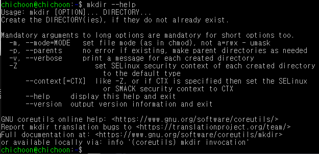
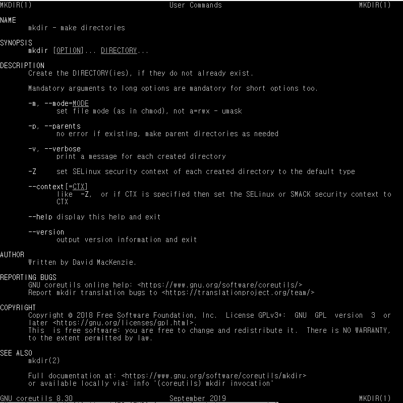
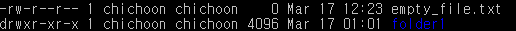

# UNIX

## UNIX

- 거의 모든 운영 체제의 뿌리가 되는 운영체제
- 리눅스, 안드로이드, 맥OS 등
- **CLI** 형식으로 동작
  - **GUI**: Graphical User Interface (아이콘과 윈도우 등 이미지 요소로 구성)
  - **CLI**: Command Line Interface (글자만으로 구성)
- 다중 사용자 시스템 (하나의 컴퓨터를 여러 사람들이 사용)
  - 이 방식 때문에 모든 파일과 폴더에 사용자 권한 (Permission) 을 부여할 수 있음

## 명령어

- CLI 환경에서 명령을 내릴 때 각 줄의 맨 앞에 오는 단어
- 해당 단어가 무엇인지에 따라 서로 다른 행동을 취한다
- 이들은 unix 환경에 내장되어 있는 프로그램이기 때문에 명령어를 사용하면 해당 프로그램이 실행되는 것이다

### [명령어 목록](commands.md)

### 명령어 뒤에 추가명령하기

- 명령어 (ls, mkdir 등) 뒤에 - 붙이고 원하는 **옵션 (패러미터라고도 함)**를 붙여서 실행
  - 예시: **ls -l** 에서 -l이 옵션 또는 옵션
- **-로 시작하는 옵션**은 축약형, **--로 시작하는 옵션**은 단어 그대로
  - **-p와 --parents**는 같은 뜻이다
- 이러한 옵션들은 사전에 약속된 값들이 있기 때문에 지켜줘야함 **대소문자 주의!!**
- 옵션을 잘 모르겠으면 [명령어] --help 치면 사용가능한 옵션 알려줌
- 옵션을 여러 개 치면 (예시: **ls -a -l** 또는 **ls -al**) 해당 옵션을 전부 적용해서 보여준다

## 명령어 도움말

### [명령어] --help

- 명령어에 대한 도움말을 보여줌
- 도움말과 함께 사용가능한 옵션들을 간단한 설명과 함께 알려준다
- 현재 창에서 간단한 설명만을 출력하기 때문에 아래에 다른 명령줄을 이어서 입력할 수 있음

### man [명령어]

- 명령어에 대한 상세한 도움말을 보여줌
- help와 마찬가지로 사용가능한 옵션들을 설명과 함께 알려준다
- **↑↓**를 이용해서 위아랫줄로 탐색 가능
- **/[검색할단어]** 치면 검색할 단어를 모두 하이라이트해줌
  - 검색중에 **n**키를 누르면 다음 줄의 sort를 찾아줌
- **q** 를 누르면 페이지에서 빠져나올 수 있음
- 새 창에서 전용 페이지에 설명, 제작자, 저작권 등까지 모두 표시하기 때문에 아까 하던 작업을 마저 하려면 창에서 빠져나와야 함

## 파일 타입 및 권한 목록

- **d**는 파일 타입
  - **d**: 디렉토리
  - **b**: 블록 타입 특수파일
  - **c**: 문자 타입 특수파일
  - **l**: 심볼릭 링크
  - **p**: 파이프
  - **s**: 소켓
  - 이들에 해당하지 않을 경우 **-** (일반 파일))
- **rwxr-xr-x**는 파일 권한
  - **r**: 읽기 권한 (파일을 열어볼 수 있고 복사 가능)
  - **w**: 쓰기 권한 (파일 편집 가능)
  - **x**: 실행 권한 (프로그램 파일, 쉘 스크립트 파일 등)
  - 세개 다 ---로 권한 지정이 되어있지 않을 경우 접근 불가
  - 디렉토리에 x 권한이 없다면 접근 불가
  - 디렉토리에 r 권한이 없다면 파일 목록 조회 불가
  - **왜 9자리인가**?
    - 처음의 3글자는 소유자 권한
    - 두번째 3글자는 그룹 사용자 권한
    - 세번째 3글자는 기타 사용자 권한

## sudo

- **Superuser do**
- 모든 권한을 무시하고 명령을 내릴 수 있는 최고 권한 (superuser 또는 root user)
- 보통 UNIX 체제에 뭔가를 설치하거나 중요한 파일을 지울 때 Permission Denied가 뜨게 되는데, 이를 무시하고 관리자 권한으로 동작을 시키고 싶을 때 sudo를 사용
- **sudo [명령어]** 는 해당 명령어에 대해서만 최고권한으로 실행
- **sudo su**는 최고 권한으로 전환

### [명령어 목록](sudo.md)
