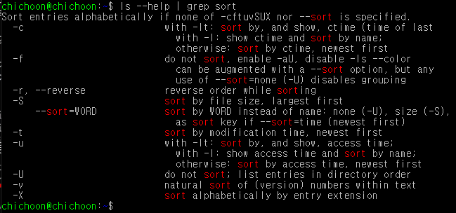

# UNIX

### 목차

1. [UNIX](#UNIX)
2. [명령어](#명령어)
3. [명령어 도움말](#명령어-도움말)
4. [파일 타입 및 권한 목록](#파일-타입-및-권한-목록)
5. [sudo](#sudo)
6. [UNIX 패키지 매니저](#UNIX-패키지-매니저)
7. [UNIX 파일 다운로드](#UNIX-파일-다운로드)
8. [UNIX 파일 에디터](#UNIX-파일-에디터)
9. [파이프라인](#파이프라인)
10. [IO redirection](#IO-redirection)
11. [디렉토리의 구조](#디렉토리의-구조)

## UNIX

- 거의 모든 운영 체제의 뿌리가 되는 운영체제
- 리눅스, 안드로이드, 맥OS 등
- **CLI** 형식으로 동작
  - **GUI**: Graphical User Interface (아이콘과 윈도우 등 이미지 요소로 구성)
  - **CLI**: Command Line Interface (글자만으로 구성)
  - CLI가 GUI보다 훨씬 에너지를 덜 잡아먹고 순차적인 일을 할 때 속도가 빠르다
- 다중 사용자 시스템 (하나의 컴퓨터를 여러 사람들이 사용)
  - 이 방식 때문에 모든 파일과 폴더에 사용자 권한 (Permission) 을 부여할 수 있음

## 명령어

- CLI 환경에서 명령을 내릴 때 각 줄의 맨 앞에 오는 단어
- 해당 단어가 무엇인지에 따라 서로 다른 행동을 취한다
- 이들은 unix 환경에 내장되어 있는 프로그램이기 때문에 명령어를 사용하면 해당 프로그램이 실행되는 것이다
- 명령을 한 번에 2개 이상 내리는 방법: **; (세미콜론)** 으로 구분하기
  - 예시: mkdir test; cd test;

### [명령어 목록](commands.md)

### 명령어 뒤에 추가명령하기

- 명령어 (ls, mkdir 등) 뒤에 - 붙이고 원하는 **옵션 (패러미터라고도 함)**를 붙여서 실행
  - 예시: **ls -l** 에서 -l이 옵션 또는 옵션
- **-로 시작하는 옵션**은 축약형, **--로 시작하는 옵션**은 단어 그대로
  - **-p와 --parents**는 같은 뜻이다
- 이러한 옵션들은 사전에 약속된 값들이 있기 때문에 지켜줘야함 **대소문자 주의!!**
- 옵션을 잘 모르겠으면 [명령어] --help 치면 사용가능한 옵션 알려줌
- 옵션을 여러 개 치면 (예시: **ls -a -l** 또는 **ls -al**) 해당 옵션을 전부 적용해서 보여준다

## 명령어 도움말

### [명령어] --help

- 명령어에 대한 도움말을 보여줌
- 도움말과 함께 사용가능한 옵션들을 간단한 설명과 함께 알려준다
- 현재 창에서 간단한 설명만을 출력하기 때문에 아래에 다른 명령줄을 이어서 입력할 수 있음

### man [명령어]

- 명령어에 대한 상세한 도움말을 보여줌
- help와 마찬가지로 사용가능한 옵션들을 설명과 함께 알려준다
- **↑↓**를 이용해서 위아랫줄로 탐색 가능
- **/[검색할단어]** 치면 검색할 단어를 모두 하이라이트해줌
  - 검색중에 **n**키를 누르면 다음 줄의 sort를 찾아줌
- **q** 를 누르면 페이지에서 빠져나올 수 있음
- 새 창에서 전용 페이지에 설명, 제작자, 저작권 등까지 모두 표시하기 때문에 아까 하던 작업을 마저 하려면 창에서 빠져나와야 함

## [파일 타입 및 권한 목록](type&permission.md)

## sudo

- **Superuser do**
- 모든 권한을 무시하고 명령을 내릴 수 있는 최고 권한 (superuser 또는 root user)
- 보통 UNIX 체제에 뭔가를 설치하거나 중요한 파일을 지울 때 Permission Denied가 뜨게 되는데, 이를 무시하고 관리자 권한으로 동작을 시키고 싶을 때 sudo를 사용
- **sudo [명령어]** 는 해당 명령어에 대해서만 최고권한으로 실행
- **sudo su**는 최고 권한으로 전환

## UNIX 패키지 매니저

- 앱스토어처럼 패키지를 환경에 설치하도록 돕는 기능

### apt

- **advanced packaging tool**
- 이미 저장된 패키지들을 최신 버전으로 업그레이드하거나 패키지 설치 시에 사용되는 명령어
- sudo가 없으면 permission denied됨

### [apt 명령 목록](sudo.md)

## UNIX 파일 다운로드

- url을 입력해서 해당 url의 파일을 다운로드 하는 방식

### wget -O [파일명] [url]

- url에 해당하는 파일을 파일명으로 저장함

### git

- 버전관리 시스템
- git 내역들을 온라인에 저장하는 시스템이 github
- 오픈소스 프로젝트의 소스코드가 많이 올라와있음

#### git clone [github주소명] [폴더명]

- 지정한 폴더에 github 주소에 해당하는 소스코드를 가져와서 저장함

## UNIX 파일 에디터

- 파일 에디터 (메모장같은 느낌)
- vscode 같은 거창한 형식은 아니고 그냥 단축키 붙은 메모장같다

### nano

- 다루기 좀 더 쉬움 (하단에 단축키 목록이 있고, 단축키도 쉬운 편)
- nano [경로명] -> 파일 열기
- 단축키 목록
  - **ctrl + o** : 저장 (파일명을 적고 엔터)
  - **ctrl + x** : 창 닫기
  - **ctrl + k** : 잘라내기 (복사기능이 없기 때문에 이걸 사용해서 복사도 해야함)
  - **ctrl + u** : 붙여넣기
  - **ctrl + 6** : mark set (vscode의 shift처럼 방향키를 이용한 다중선택 가능)
  - **ctrl + w** : 텍스트 검색

### vi

- 입문하기 매우 어렵지만 익숙해지면 편리
- [vim 가이드라인](vim.md)

## 파이프라인

- 한 프로그램의 출력물을 다른 프로그램의 입력으로 사용하는 구조
- UNIX 환경에서는 여러 명령을 |로 이으면 파이프라인 사용 가능
  - 한 명령어에서 나온 결과를 다른 명령어를 사용할 때의 argument로 사용할 수 있다
    > 예시: **ls --help | grep sort**
  - 
  - **ls --help** 명령에서 출력되는 결과 (ls 명령어의 설명) 를 **grep 명령어의 argument로 넣어줌**으로써 결과적으로 ls 명령어에 대한 설명에서 sort가 포함된 줄만을 출력함

## IO redirection

- Input과 Output이 물흐르듯 자연스럽게 이어지는 것을 IO Stream이라고 함
- 통상적으로 출력되어야 할 형태를 방향을 바꿔서 다른 방법으로 출력시킬 때 Redirection이라 한다

### [IO redirection 종류](ioredir.md)

## 디렉토리의 구조
