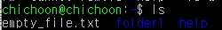

⢀⢀⢀⢀⢀⢀⢀⢀⢀⢀⢠⣴⣾⣿⣶⣶⣆⢀⢀⢀⢀⢀⢀⢀⢀⢀⢀⢀⢀  
⢀⢀⢀⣀⢀⣤⢀⢀⡀⢀⣿⣿⣿⣿⣷⣿⣿⡇⢀⢀⢀⢀⣤⣀⢀⢀⢀⢀⢀  
⢀⢀ ⣶⢻⣧⣿⣿⠇ ⢸⣿⣿⣿⣷⣿⣿⣿⣷⢀⢀⢀⣾⡟⣿⡷⢀⢀⢀⢀  
⢀⢀⠈⠳⣿⣾⣿⣿⢀⠈⢿⣿⣿⣷⣿⣿⣿⣿⢀⢀⢀⣿⣿⣿⠇⢀⢀⢀⢀  
⢀⢀⢀⢀⢿⣿⣿⣿⣤⡶⠺⣿⣿⣿⣷⣿⣿⣿⢄⣤⣼⣿⣿⡏⢀⢀⢀⢀⢀  
⢀⢀⢀⢀⣼⣿⣿⣿⠟⢀⢀⠹⣿⣿⣿⣷⣿⣿⣎⠙⢿⣿⣿⣷⣤⣀⡀⢀⢀  
⢀⢀⢀ ⢸⣿⣿⣿⡿⢀⢀⣤⣿⣿⣿⣷⣿⣿⣿⣄⠈⢿⣿⣿⣷⣿⣿⣷⡀⢀  
⢀⢀⢀⣿⣿⣿⣿⣷⣀⣀⣠⣿⣿⣿⣿⣷⣿⣷⣿⣿⣷⣾⣿⣿⣿⣷⣿⣿⣿⣆  
⣿⣿⠛⠋⠉⠉⢻⣿⣿⣿⣿⡇⡀⠘⣿⣿⣿⣷⣿⣿⣿⠛⠻⢿⣿⣿⣿⣿⣷⣦  
⣿⣿⣧⡀⠿⠇⣰⣿⡟⠉⠉⢻⡆⠈⠟⠛⣿⣿⣿⣯⡉⢁⣀⣈⣉⣽⣿⣿⣿⣷  
⡿⠛⠛⠒⠚⠛⠉⢻⡇⠘⠃⢸⡇⢀⣤⣾⠋⢉⠻⠏⢹⠁⢤⡀⢉⡟⠉⡙⠏⣹  
⣿⣦⣶⣶⢀⣿⣿⣿⣷⣿⣿⣿⡇⢀⣀⣹⣶⣿⣷⠾⠿⠶⡀⠰⠾⢷⣾⣷⣶⣿  
⣿⣿⣿⣿⣇⣿⣿⣿⣷⣿⣿⣿⣇⣰⣿⣿⣷⣿⣿⣷⣤⣴⣶⣶⣦⣼⣿⣿⣿⣷  
★: 중요하다는 뜻 (그만큼 중요하다는 거지)  
 

# UNIX

- **CLI** 형식으로 동작
  - **GUI**: Graphical User Interface (아이콘과 윈도우 등 이미지 요소로 구성)
  - **CLI**: Command Line Interface (글자만으로 구성)

## 명령어

- CLI 환경에서 명령을 내릴 때 각 줄의 맨 앞에 오는 단어
- 해당 단어가 무엇인지에 따라 서로 다른 행동을 취한다
- 이들은 unix 환경에 내장되어 있는 프로그램이기 때문에 명령어를 사용하면 해당 프로그램이 실행되는 것이다

### 명령어 뒤에 추가명령하기

- 명령어 (ls, mkdir 등) 뒤에 - 붙이고 원하는 **옵션 (패러미터라고도 함)**를 붙여서 실행
  - 예시: **ls -l** 에서 -l이 옵션 또는 옵션
- **-로 시작하는 옵션**은 축약형, **--로 시작하는 옵션**은 단어 그대로
  - **-p와 --parents**는 같은 뜻이다
- 이러한 옵션들은 사전에 약속된 값들이 있기 때문에 지켜줘야함 **대소문자 주의!!**
- 옵션을 잘 모르겠으면 [명령어] --help 치면 사용가능한 옵션 알려줌
- 옵션을 여러 개 치면 (예시: **ls -a -l** 또는 **ls -al**) 해당 옵션을 전부 적용해서 보여준다

### pwd

- 현재 경로 출력
- **최상위 디렉토리**: /
  - 따라서 /home/ 은 / (루트) 디렉토리 아래의 home 폴더

### ★ls

- 현재 위치에 있는 모든 파일과 폴더 출력

#### ls -l

- 현재 위치에 있는 모든 파일과 폴더를 자세히 출력
- 디렉토리 여부, 파일 권한, 용량, 만든사람, 만든날짜, 확장자

#### ls -a

- 숨김파일/폴더까지 합쳐서 전부 보여줌 (숨김파일: .로 시작하는 파일 및 폴더)

### ★cd [파일경로]

- 해당 경로로 이동
- **cd ..**은 이전 폴더로 이동

### mkdir

- 현재 위치에 새 폴더 생성

#### mkdir -p [경로1]/[경로2]/[경로3]

- 현재 위치에 특정 경로 생성
  - 먼저 경로3을 만들기 위해 경로2의 존재여부를 체크
  - 경로2가 존재하지 않을 경우 경로1의 존재여부를 체크
  - 경로1이 존재하지 않을 경우 경로1 폴더를 현재 경로에 생성
  - 경로1 폴더 내부에 경로2 폴더를 생성
  - 경로2 폴더 내부에 경로3 폴더를 생성
- **-p**를 붙이면 부모 디렉토리의 존재여부를 체크하여 존재하지 않을 때 부모 디렉토리까지 전부 만들어줌
- **-p**가 없으면 부모 디렉토리가 존재하지 않을 때 에러 발생

### touch [파일명]

- 파일명에 해당하는 파일이 있을 경우 최근 수정일을 변경
- 파일명에 해당하는 파일이 없을 경우 빈 파일을 새로 생성

### cp [파일경로1] [파일경로2]

- 파일경로1에 해당하는 파일을 파일경로 2에 복사해 넣는다
- 파일이름은 다르게 해도 됨

### mv [파일경로1] [파일경로2]

- 파일경로1에 해당하는 파일을 파일경로 2로 이동시킨다
- 마찬가지로 파일이름은 다르게 해도 됨
- 경로는 똑같이 하고 파일명만 다르게 하면 (예: mv test1 test2) 이름만 변경됨

### rm [파일명]

- 해당 파일을 삭제

#### rm -d [폴더명]

- 해당 폴더가 비어있지 않을 경우 폴더 삭제

#### rm -r [폴더명]

- 폴더와 하위 폴더 / 파일 모두 삭제

#### rm -f [파일/폴더명]

- 에러 표시 없이 강제로 전부 삭제

## 명령어 도움말

### [명령어] --help

- 명령어에 대한 도움말을 보여줌
- 도움말과 함께 사용가능한 옵션들을 간단한 설명과 함께 알려준다
- 현재 창에서 간단한 설명만을 출력하기 때문에 아래에 다른 명령줄을 이어서 입력할 수 있음

### man [명령어]

- 명령어에 대한 상세한 도움말을 보여줌
- help와 마찬가지로 사용가능한 옵션들을 설명과 함께 알려준다
- **↑↓**를 이용해서 위아랫줄로 탐색 가능
- **/[검색할단어]** 치면 검색할 단어를 모두 하이라이트해줌
  - 검색중에 **n**키를 누르면 다음 줄의 sort를 찾아줌
- **q** 를 누르면 페이지에서 빠져나올 수 있음
- 새 창에서 전용 페이지에 설명, 제작자, 저작권 등까지 모두 표시하기 때문에 아까 하던 작업을 마저 하려면 창에서 빠져나와야 함

## 파일 타입 및 권한 목록

- **d**는 파일 타입
  - **d**: 디렉토리
  - **b**: 블록 타입 특수파일
  - **c**: 문자 타입 특수파일
  - **l**: 심볼릭 링크
  - **p**: 파이프
  - **s**: 소켓
  - 이들에 해당하지 않을 경우 **-** (일반 파일))
- **rwxr-xr-x**는 파일 권한
  - **r**: 읽기 권한 (파일을 열어볼 수 있고 복사 가능)
  - **w**: 쓰기 권한 (파일 편집 가능)
  - **x**: 실행 권한 (프로그램 파일, 쉘 스크립트 파일 등)
  - 세개 다 ---로 권한 지정이 되어있지 않을 경우 접근 불가
  - 디렉토리에 x 권한이 없다면 접근 불가
  - 디렉토리에 r 권한이 없다면 파일 목록 조회 불가
  - **왜 9자리인가**?
    - 처음의 3글자는 소유자 권한
    - 두번째 3글자는 그룹 사용자 권한
    - 세번째 3글자는 기타 사용자 권한
