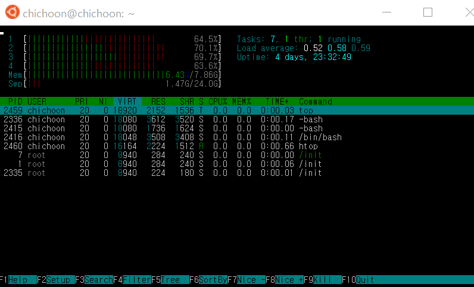

⢀⢀⢀⢀⢀⢀⢀⢀⢀⢀⢠⣴⣾⣿⣶⣶⣆⢀⢀⢀⢀⢀⢀⢀⢀⢀⢀⢀⢀  
⢀⢀⢀⣀⢀⣤⢀⢀⡀⢀⣿⣿⣿⣿⣷⣿⣿⡇⢀⢀⢀⢀⣤⣀⢀⢀⢀⢀⢀  
⢀⢀ ⣶⢻⣧⣿⣿⠇ ⢸⣿⣿⣿⣷⣿⣿⣿⣷⢀⢀⢀⣾⡟⣿⡷⢀⢀⢀⢀  
⢀⢀⠈⠳⣿⣾⣿⣿⢀⠈⢿⣿⣿⣷⣿⣿⣿⣿⢀⢀⢀⣿⣿⣿⠇⢀⢀⢀⢀  
⢀⢀⢀⢀⢿⣿⣿⣿⣤⡶⠺⣿⣿⣿⣷⣿⣿⣿⢄⣤⣼⣿⣿⡏⢀⢀⢀⢀⢀  
⢀⢀⢀⢀⣼⣿⣿⣿⠟⢀⢀⠹⣿⣿⣿⣷⣿⣿⣎⠙⢿⣿⣿⣷⣤⣀⡀⢀⢀  
⢀⢀⢀ ⢸⣿⣿⣿⡿⢀⢀⣤⣿⣿⣿⣷⣿⣿⣿⣄⠈⢿⣿⣿⣷⣿⣿⣷⡀⢀  
⢀⢀⢀⣿⣿⣿⣿⣷⣀⣀⣠⣿⣿⣿⣿⣷⣿⣷⣿⣿⣷⣾⣿⣿⣿⣷⣿⣿⣿⣆  
⣿⣿⠛⠋⠉⠉⢻⣿⣿⣿⣿⡇⡀⠘⣿⣿⣿⣷⣿⣿⣿⠛⠻⢿⣿⣿⣿⣿⣷⣦  
⣿⣿⣧⡀⠿⠇⣰⣿⡟⠉⠉⢻⡆⠈⠟⠛⣿⣿⣿⣯⡉⢁⣀⣈⣉⣽⣿⣿⣿⣷  
⡿⠛⠛⠒⠚⠛⠉⢻⡇⠘⠃⢸⡇⢀⣤⣾⠋⢉⠻⠏⢹⠁⢤⡀⢉⡟⠉⡙⠏⣹  
⣿⣦⣶⣶⢀⣿⣿⣿⣷⣿⣿⣿⡇⢀⣀⣹⣶⣿⣷⠾⠿⠶⡀⠰⠾⢷⣾⣷⣶⣿  
⣿⣿⣿⣿⣇⣿⣿⣿⣷⣿⣿⣿⣇⣰⣿⣿⣷⣿⣿⣷⣤⣴⣶⣶⣦⣼⣿⣿⣿⣷  
★: 중요하다는 뜻 (그만큼 중요하다는 거지)  
 

# 명령어 목록

## pwd

- **print working directory**
- 현재 경로 출력
- **최상위 디렉토리**: /
  - 따라서 /home/ 은 / (루트) 디렉토리 아래의 home 폴더

## ★ls

- **list**
- 현재 위치에 있는 모든 파일과 폴더 출력

### ls -l

- 현재 위치에 있는 모든 파일과 폴더를 자세히 출력
- 디렉토리 여부, 파일 권한, 용량, 만든사람, 만든날짜, 확장자

### ls -a

- 숨김파일/폴더까지 합쳐서 전부 보여줌 (숨김파일: .로 시작하는 파일 및 폴더)

## ★cd [파일경로]

- **change directory**
- 해당 경로로 이동
- **cd ..**은 이전 폴더로 이동
- **cd ~** 은 현재 사용자의 home 폴더로 이동
- **cd /** 은 루트 폴더로 이동

## mkdir

- **make directory**
- 현재 위치에 새 폴더 생성

### mkdir -p [경로1]/[경로2]/[경로3]

- 현재 위치에 특정 경로 생성
  - 먼저 경로3을 만들기 위해 경로2의 존재여부를 체크
  - 경로2가 존재하지 않을 경우 경로1의 존재여부를 체크
  - 경로1이 존재하지 않을 경우 경로1 폴더를 현재 경로에 생성
  - 경로1 폴더 내부에 경로2 폴더를 생성
  - 경로2 폴더 내부에 경로3 폴더를 생성
- **-p**를 붙이면 부모 디렉토리의 존재여부를 체크하여 존재하지 않을 때 부모 디렉토리까지 전부 만들어줌
- **-p**가 없으면 부모 디렉토리가 존재하지 않을 때 에러 발생

## touch [파일명]

- 파일명에 해당하는 파일이 있을 경우 최근 수정일을 변경
- 파일명에 해당하는 파일이 없을 경우 빈 파일을 새로 생성

## echo [아무말]

- 내가 한 말을 똑같이 반복해준다

## cp [파일경로1] [파일경로2]

- **copy**
- 파일경로1에 해당하는 파일을 파일경로 2에 복사해 넣는다
- 파일이름은 다르게 해도 됨

## mv [파일경로1] [파일경로2]

- **move**
- 파일경로1에 해당하는 파일을 파일경로 2로 이동시킨다
- 마찬가지로 파일이름은 다르게 해도 됨
- 경로는 똑같이 하고 파일명만 다르게 하면 (예: mv test1 test2) 이름만 변경됨

## rm [파일명]

- **remove**
- 해당 파일을 삭제

### rm -d [폴더명]

- 해당 폴더가 비어있지 않을 경우 폴더 삭제

### rm -r [폴더명]

- 폴더와 하위 폴더 / 파일 모두 삭제

### rm -f [파일/폴더명]

- 에러 표시 없이 (묻지도 따지지도 말고) 강제로 전부 삭제

## cat

- **concatenate**
- 파일 내용을 화면상에 표시해줌

## grep [문자열] [파일]

- **global regular expression print**
- 문자열이 포함된 줄만을 (문자열을 하이라이트한 상태로) 화면에 출력

## chmod [권한설정] [파일명]

- **change mode**
- 해당 파일의 읽기/쓰기/실행 권한을 변경
- 권한별 코드
  - 읽기 코드: **4**
  - 쓰기 코드: **2**
  - 실행 코드: **1**
- 각 자리 숫자는 읽기, 쓰기, 실행 코드를 **더해서** 구성
  - 만약 읽기권한과 실행권한만 준다면 -> 4 + 1 = 5
  - 읽기, 쓰기, 실행 전부 준다면 -> 4 + 2 + 1 = 7
- 3자리 숫자 중 첫번째는 **소유자 권한**, 두번째는 **그룹사용자** 권한, 세번째는 **기타사용자** 권한이다
  - 따라서 777은 세 종류 사용자에게 rwx 권한 모두 부여
  - 755는 소유자만 rwx, 나머지 사용자에게 r-x 권한 부여
- chmod 777 test.txt -> test.txt 파일에 rwx 권한을 모든 사용자에 대하여 부여한다는 뜻

### chmod -r [권한설정] [경로명]

- recursive하게 해당 권한을 폴더 및 하위 경로 폴더 / 파일에 모두 적용

### chmod [권한설정] {} \;

- 현재 폴더 내에 있는 모든 파일 및 폴더에 대하여 해당 권한 적용

## head [텍스트파일]

- 텍스트파일 앞의 열 줄만 출력해줌
- head -n[숫자] 입력시엔 해당 숫자만큼의 줄만 출력해줌
- 예시: head -n1 input.txt 하면 input.txt의 첫 번째 줄만 출력

## [명령어] \*.[확장자]

- 같은 확장자를 가진 여러 파일을 한번에 선택하여 명령을 실행시킬 때
- 예시: cp \*.log folder1 은 폴더내 확장자가 log인 파일을 folder1 경로에 copy함

## ps

- 현재 구동중인 프로세스들을 확인

### ps aux

- 백그라운드에서 실행중인 기본 프로세스들까지 모두 확인

## top

- 프로세스를 더 보기좋게 나열해줌

## htop

- top과 비슷하면서 색과 그래프가 들어있어 더 보기 좋은 프로세스 비교 프로그램
- **상단 바의 항목들** (PRI, NI, CPU%, MEM% 등) 을 더블클릭하면 해당 값들 기준으로 오름/내림차순 정렬하여 볼 수 있음
  - CPU% : CPU 점유율
  - MEM% : 메모리 점유율
  - TIME+ : 누적 실행 시간
  - Command : 어떤 명령어로 실행되었는지 알려줌
  - RES : 물리적 메모리 크기 차지하는 양 (비율 아님) -> 해당 값의 전체 용량에 대한 비율은 MEM
- **좌상단의 그래프**는 CPU 코어와 메모리 상태를 보여줌 (얼마나 바쁜가?)
  - 100%에 가까울 수록 컴퓨터가 혹사당하고 있음을 의미
- **우상단의 값들**은 실행 시간이나 부하량을 볼 수 있다
  - Task는 현재 실행중인 task의 개수
  - Load average는 부하율 (컴퓨터가 얼마나 바쁜지) 의 평균
    - 첫번째 자리는 1분간의 점유율
    - 두번째 자리는 5분간의 점유율
    - 세번째 자리는 15분간의 점유율
  - Uptime은 동작중인 시간

## kill [프로세스 ID]

- 프로세스 종료
- Sudo 명령어

## gcc [소스코드이름] -o [결과물이름]

- c언어 컴파일
