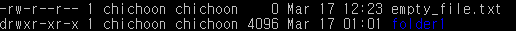

# 파일 타입 및 권한 목록

- **d**는 파일 타입
  - **d**: 디렉토리
  - **b**: 블록 타입 특수파일
  - **c**: 문자 타입 특수파일
  - **l**: 심볼릭 링크
  - **p**: 파이프
  - **s**: 소켓
  - 이들에 해당하지 않을 경우 **-** (일반 파일))
- **rwxr-xr-x**는 파일 권한
  - **r**: 읽기 권한 (파일을 열어볼 수 있고 복사 가능)
  - **w**: 쓰기 권한 (파일 편집 가능)
  - **x**: 실행 권한 (프로그램 파일, 쉘 스크립트 파일 등)
  - 세개 다 ---로 권한 지정이 되어있지 않을 경우 접근 불가
  - 디렉토리에 x 권한이 없다면 접근 불가
  - 디렉토리에 r 권한이 없다면 파일 목록 조회 불가
  - **왜 9자리인가**?
    - 처음의 3글자는 소유자 권한
    - 두번째 3글자는 그룹 사용자 권한
    - 세번째 3글자는 기타 사용자 권한
